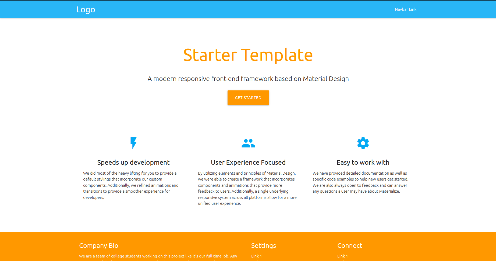

<h1>Materialize Page</h1>

Essa página foi criada para praticar o uso da biblioteca MaterializeCSS, juntamente com isso, também o uso componentes da biblioteca em questão.

<h3>Used Technologies</h3>

<h3>Developed Interface</h3>
